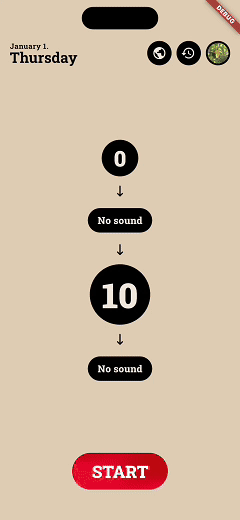

# Dhyana - Meditation Timer (Work in Progress)

## Overview

A minimalist meditation timer designed to eliminate distractions, when you just need a timer to support your practice. Built with a focus on clean, well-crafted interfaces and scalable cloud architecture.

## Tech stack: 
- Flutter 
- Firebase 
- Google Cloud Platform

## Clean Architecture (+)
- Presentation: Widgets, Blocs, Cubits
- Domain: Models, Repository Interfaces, Service Interfaces, Service Implementations
- Data: Repository Implementations DataProvider Interfaces, DataProvider Implementations
- Dependency Injection: Provider
- Flavors: Dev, Staging, Prod
- Localization
- Crashlytics
- Unit tests (mostly) using mocktail

## Features

### Timer Settings
- Preparation time
- Starting sound
- Duration
- Ending sound
- Settings history

### Timer / Session
- Display timer phases
- Dimmable screen
- Pause timer
- Discard session / Finish session

### Profile
- Edit profile
  - Profile image
  - Firstname
  - Lastname
  - Location, geohash (City Selector via Cloud Functions / Google Maps API)
- Profile settings
  - Show / Hide statistics and progress 
  - Show / Hide current time on timer settings screen
  - Participate in social functionality
- Delete profile

### Statistics
- Session history
- Count consecutive days
- Count milestones (after every 7 consecutive days)
- Count minutes, days, sessions
- Display statistics in bar chart with selectable timeframes (days, weeks, months, years)

### Social
- Show who you have practiced with
- Sort practitioners by closest location (via GeoHashing)

### Custom Widget Packages
- **Barchart widget** with an aim on visual independency
- **Particle System** initial *prototype version*

## Getting Started

The application won't run without platform specific firebase configuration files placed into its folder according to flavor being built against.

### Prerequisites
- flutter
- firebase cli
- gsutil cli
- gcloud cli

### Setup
1. Clone the repo: `git clone ...`
2. Install dependencies: `flutter pub get`
3. Add your `google-services.json` and `GoogleService-Info.plist` files to the respective flavor folders:
   - `ios/config/staging/`
   - `android/app/src/staging/`
4. Run the app: `flutter run --flavor staging -t lib/main_staging.dart`

### Useful commands

- generate localizations: `flutter gen-l10n`
- generate code: `dart run build_runner build`
- start firebase emulator: `./start_firebase_emulator.sh -d empty_with_admin_user`

### Building

#### Staging
- release android: `flutter build appbundle --release --flavor staging -t ./lib/main_staging.dart`
- release ios: `flutter build ipa --release --flavor staging -t ./lib/main_staging.dart`

