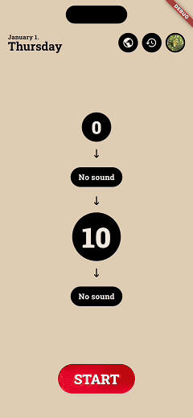

# Dhyana - Meditation Timer (Work in Progress)

## Overview

A minimalist meditation timer designed to eliminate distractions, when you just need a timer to support your practice. Built with a focus on clean, well-crafted interfaces and scalable cloud architecture.

## Tech stack: 
- Flutter
- Firebase
- Google Cloud Platform

## Clean Architecture (+)
- Presentation: Widgets, Blocs, Cubits
- Domain: Models, Repository Interfaces, Service Interfaces, Service Implementations
- Data: Repository Implementations DataProvider Interfaces, DataProvider Implementations
- Dependency Injection: Provider
- Flavors: Dev, Staging, Prod
- Localization
- Crashlytics
- Unit tests (mostly) using mocktail

## Features

### Timer
- Preparation time
- Starting sound
- Duration
- Interval sounds
- Ending sound
- Settings history
- Runs in the background with lock-screen support
- Display timer phases
- Dimmable screen
- Pause timer
- Discard session / Finish session

### Chanting Session
- Karaoke-style audio playback with lyrics
- Create custom playlists
- Variable gap-length between chants

### Profile
- Edit profile
  - Profile image
  - Firstname
  - Lastname
  - Location, geohash (City Selector via Cloud Functions / Google Maps API)
- Profile settings
  - Show / Hide statistics and progress 
  - Show / Hide current time on timer settings screen
  - Participate in social functionality
- Delete profile

### Statistics
- Session history
- Count consecutive days
- Count milestones (after every 7 consecutive days)
- Count minutes, days, sessions
- Display statistics in bar chart with selectable timeframes (days, weeks, months, years)

### Social
- Show who you have practiced with
- Sort practitioners by closest location (via GeoHashing)

### Custom Packages
- **Barchart widget** with an aim on visual independency
- **Particle System widget** initial *prototype version*
- **ASSA Subtitle parser** for chanting feature
- **Mindful minutes health sync** with Apple Health and Android Healthkit support

## Prerequisites
- flutter
- firebase cli
- gsutil cli
- gcloud cli

## Getting Started

Look at AGENTS.md on how to get started with the project.

