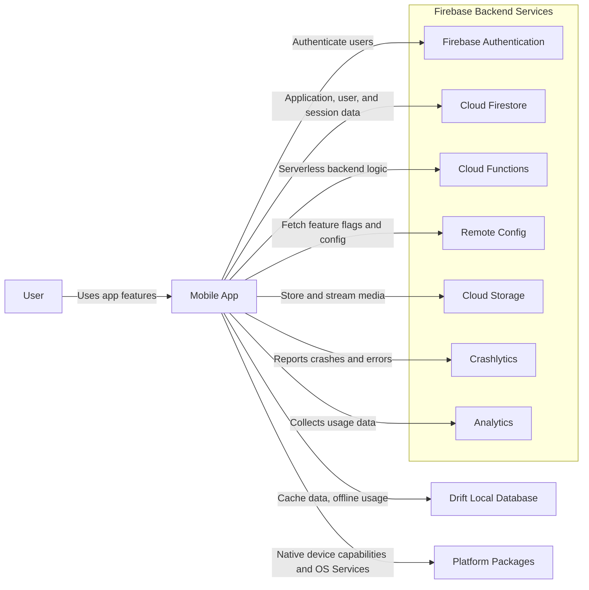

# Architectural Overview Document

## 1. Context
Dhyana is a mobile application built that provides helpful tools for mental health practitioners.

### 1.1 Application Purpose
The application's purpose is to provide tools for sitting meditation and chanting meditation pratices, records session data, and provides insights into the user's practice. The practice is supported by a social feature that connects users who practiced at the same time.

### 1.2 Technical Goals

#### Pragmatic simplicity
Finding a balance between providing scalable building blocks for growing feature complexity and keeping over-engineering, boilerplate, and pass-through layers out of the codebase.

#### Cross-Platform Development
The application is built using Flutter, which allows for cross-platform development. This enables one codebase to be used for both iOS and Android platforms.

#### Modular Architecture
Features are organized into domain modules, each encapsulating its own data management, business logic, and presentation layers. Modules offer public APIs and view components to other modules. The core module provides entry point into the application with shared services, utilities. 

#### Dependency Injection
A Service Locator pattern is used for dependency injection, allowing for easy configuration and management of dependencies across the application.

#### Serverless Backend
The application uses Firebase as a comprehensive Backend-as-a-Service (BaaS) platform that operates on a serverless model.

#### Environment Flavors
Support for multiple environments (development, staging, production) is provided through the use of Flutter flavors with multiple entry points:
- Local: `lib/main_local.dart`
- Staging: `lib/main_staging.dart`
- Production: `lib/main_prod.dart`

### 1.3 Target Audience
This document is intended for developers who are working on the Dhyana application. It provides an overview of the architecture, design principles, and module structure. It helps onboarding new developers and maintain consistency across the codebase.

### 1.4 System Context Diagram




## 2. Architecture & Patterns
This project follows Clean Architecture principles organized in a modularized, feature-driven structure.

### 2.1. Layer Breakdown
Uses a pragmatic, compressed version of Clean Architecture Layers.

#### 2.1.1. Layer Mapping

```text
+--------------------------------------------------------------+
| CLEAN ARCHITECTURE (4 LAYERS)   --->  PRAGMATIC (3 LAYERS)   |
+--------------------------------------------------------------+
| 1. Entities                     --->  DOMAIN LAYER           |
| 2. Use Cases                    --->  DOMAIN LAYER           |
+--------------------------------------------------------------+
| 3. Interface Adapters           --->  PRESENTATION & DATA    |
|    - Presenters / Controllers   --->   ↳ Presentation        |
|    - Repository Impls / Mappers --->   ↳ Data                |
+--------------------------------------------------------------+
| 4. Frameworks & Drivers         --->  PRESENTATION & DATA    |
|    - Flutter UI / Widgets       --->   ↳ Presentation        |
|    - DB (Isar/Hive) / HTTP      --->   ↳ Data                |
+--------------------------------------------------------------+
```

#### 2.1.2. 

#### 2.1.2. Comparison: Original 4-Layer vs. Pragmatic 3-Layer

| Aspect | Original 4-Layer Clean Architecture | Pragmatic 3-Layer Flutter Architecture |
|--------|------------------------------------|--------------------------------------|
| Layer Breakdown | Entities, Use Cases, Interface Adapters, Frameworks & Drivers | Domain, Data, Presentation |
| Separation of Presentation/Framework | UI Framework (React/Flutter) is strictly isolated on the outer ring; Presenters/Controllers live in the inner Interface Adapters ring. | UI Widgets and State Management (BLoC/Notifier) are consolidated into the single Presentation layer. |
| Database & API Isolation | DB & Network drivers live in the outermost layer, separated from Repository Implementations. | Data Sources (DB/API) and Repository Implementations are grouped together inside the Data layer. |
| Boilerplate & File Count | High. Requires translation models/DTOs across 4 boundary lines. | Medium/Low. Mappings occur directly at the Data <-> Domain boundary. |
| Mental Overhead | High for mobile teams; often leads to "pass-through" layers that do nothing. | Low. Clear mental model matching standard Flutter application flows. |
| Dart/Flutter Alignment | Strict OO rules originally built for backend/desktop architectures. | Aligned with Flutter's reactive and declarative UI patterns. |


#### 2.1.2. Layer Responsibilities

#### 2.1.1. Data Layer
Repositories, Data Sources, Caching, and API clients.

- **Data Source Interface and Implementation**: Responsible for fetching data from remote APIs (Firebase) and local databases (Drift).
    - Remote Data Sources: Direct interaction with API clients (Firestore SDK/REST/GraphQL via Dio or http).
    - Local Data Sources: Direct interaction with local databases or storage (e.g. Drift, SharedPreferences, SecureStorage).
- **Repository Implementation**: Provides implementation to fulfill data access contracts defined in the domain layer.
- **Infrastructure Implementations**: Enables the application to use device capabilities and OS services.
- **Mappers**: Convert between Public Models, DTOs and Domain Entities.

#### 2.1.2. Domain Layer
Core application business logic and data models.

- **Entities**: Core business objects that represent the application's data model.
- **Use Cases / Interactors**: Encapsulate the application's business logic and orchestrate data flow
- **Repository Interfaces**: Define contracts for data access
- **Infrastructure Interfaces**: Define contracts for interacting with device capabilities and OS services
- **Domain Services**: Validating complex rules across multiple domain entities
- **Failures / Exceptions**: Domain-specific error objects.

#### 2.1.3. Presentation Layer
Views, Controllers/ViewModels, UI State management.

- **ViewModel / State Management (BLoC / Cubit)**: 
    - Acts as the ViewModel in traditional MVVM.
    - Consumes Use Cases from the Domain layer.
    - Emits immutable state objects (e.g., Freezed dynamic states: Initial, Loading, Success, Failure).
- **User Interface**: Passive UI built with Flutter framework components. Listens to state streams and dispatches user actions as events/calls to ViewModel.

#### 2.1.4. Public API Layer (Optional)
Provides a public interface to access the exposed functionality of each module, allowing other modules to interact with its features.

- **Module Public API**: Each module exposes a public API that allows other modules to interact with its functionality (including Models)
- **Module View Components**: Each module provides view components that can be used by other modules to build the user interface.


## 3. Tech Stack & Dependencies

### 3.1. Platform / Framework

The application uses Flutter as its cross-platform framework with Dart as the programming language. 

### 3.2. Core Dependencies

| Category | Dependency |
|----------|-------------------|
| Programming Language | Dart 3.x |
| Platform / Framework | Flutter 3.x |
| Navigation | GoRouter |
| State Management | BLoC / Cubit |
| Dependency Injection | GetIt |
| Local Database | Drift |
| Backend Services | Firebase (Auth, Firestore, Cloud Functions) |
| Lock-screen audio support | Audio Service (Just Audio) |
| Audio Playback | So Loud |

### 3.3. Minimum Supported Versions
- iOS: 16.0+
- Android: 8.0+ (API level 26+)

## 4. Data Layer & Persistence

### 4.1. Data Retrieval and Management

- Data is retrieved with Firebase SDKs for Firebase Firestore.
- Firebase provides cached data for offline usage
- Chanting audio is is first cached onto the device with stored data in local database (Drift) and then played back from the device alongside with the lyrics


Detail how data is retrieved, stored, and managed throughout its lifecycle.

Local Persistence: Database choices (e.g., Room, CoreData, Realm, SQLite) and key-value storage (e.g., EncryptedSharedPreferences, Keychain).

Caching Strategy: How offline mode is handled, cache expiration rules, and data sync protocols (e.g., optimistic updates vs. server-first).

Data Flow: A brief description or diagram of how data flows from an API call down to the UI.

## 5. Network & API Integration
Detail how the application communicates with external servers and APIs.

Protocol & Format: REST, GraphQL, WebSockets, or gRPC; payloads (JSON, Protocol Buffers).

Authentication & Authorization: Token management (JWT, OAuth 2.0), token refresh strategy, and secure storage of session tokens.

Error & Retry Handling: HTTP status code handling, network timeout policies, exponential backoff, and offline queueing.

##6. Security & Compliance
Mobile apps are particularly vulnerable to reverse engineering and data interception. Outline your defense strategy clearly.

Data Protection: Encryption standards for data-at-rest (AES-256) and data-in-transit (TLS/SSL Pinning).

Code Protection: Code obfuscation and shrinking tools used (e.g., ProGuard/R8 for Android, Bitcode/Swift obfuscation).

Secure Storage: Usage of hardware-backed keystores (iOS Keychain / Android Keystore).

Compliance: Relevant standards (GDPR, HIPAA, PCI-DSS) and how the architecture supports them.


## 7. Cross-Cutting Concerns
Address application-wide features that span across multiple layers.

| Feature Area | Details to Cover |
|--------------|-----------------|
| State Management | Global vs. screen-level state, reactive streams (Combine, Kotlin Flows, RxJava). |
| Navigation & Routing | Navigation framework, deep linking (Universal Links / App Links), back-stack management. |
| Analytics & Observability | Logging frameworks, crash reporting (e.g., Firebase Crashlytics), performance monitoring, telemetry. |
| Localization & Theme | Dynamic string translation loading, light/dark mode support, accessibility (a11y). |

## 8. Build, CI/CD & Testing Strategy
Explain how code moves from a developer's machine to production.

Testing Strategy: Test pyramid expectations (Unit Tests, Integration/UI Tests, End-to-End tests), mocking strategies, and coverage goals.

Branching & Environment Strategy: Development, Staging, and Production environments (API endpoints, feature flags).

Continuous Integration / Deployment: CI tools (e.g., GitHub Actions, Bitrise, Fastlane) and distribution channels (TestFlight, Firebase App Distribution, Google Play Internal Testing).