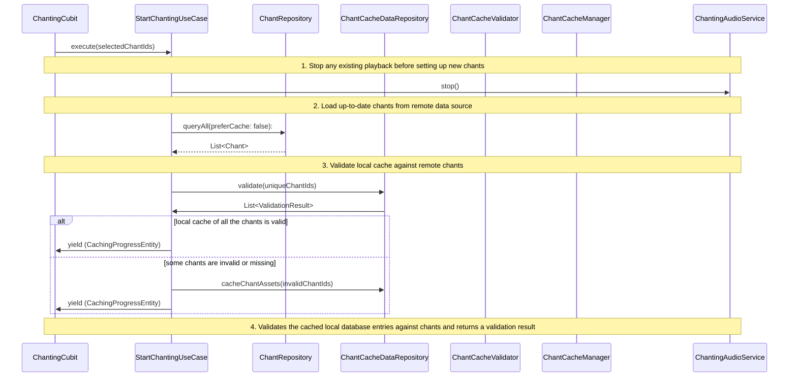

# Chanting Start Sequence Diagram

Shows the sequence of events that occur when starting chanting.

## Overview

```mermaid
sequenceDiagram
    participant Cubit as ChantingCubit
    participant UseCase as StartChantingUseCase
    participant ChantRepo as ChantRepository
    participant CacheRepo as ChantCacheDataRepository    
    participant Validator as ChantCacheValidator
    participant CacheMgr as ChantCacheManager    
    
    participant AudioSvc as ChantingAudioService

    Cubit ->> UseCase: execute(selectedChantIds)

    Note over Cubit,AudioSvc: 1. Stop any existing playback before setting up new chants
    UseCase->> AudioSvc: stop()

    Note over Cubit,AudioSvc: 2. Load up-to-date chants from remote data source
    UseCase->> ChantRepo: queryAll(preferCache: false):
    ChantRepo-->>UseCase: List<Chant>

    Note over Cubit,AudioSvc: 3. Validate local cache against remote chants
    UseCase->>CacheRepo: validate(uniqueChantIds)
    CacheRepo->>UseCase: List<ValidationResult>

    alt local cache of all the chants is valid
        UseCase->>Cubit: yield (CachingProgressEntity) 
    else some chants are invalid or missing        
        UseCase->>CacheRepo: cacheChantAssets(invalidChantIds)
        UseCase->>Cubit: yield (CachingProgressEntity)
    end

    Note over Cubit, AudioSvc: 4. Validates the cached local database entries against chants and returns a validation result


```

## CacheValidator

## CacheManager