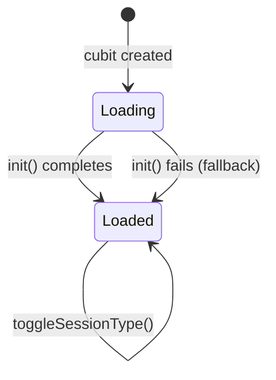
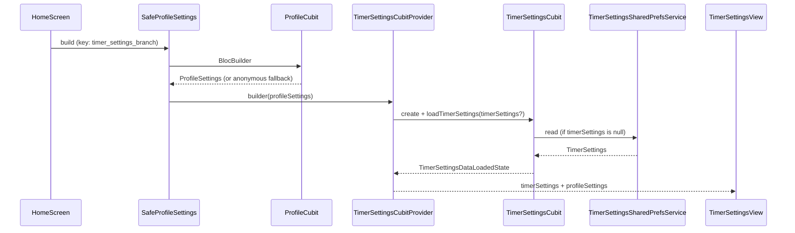
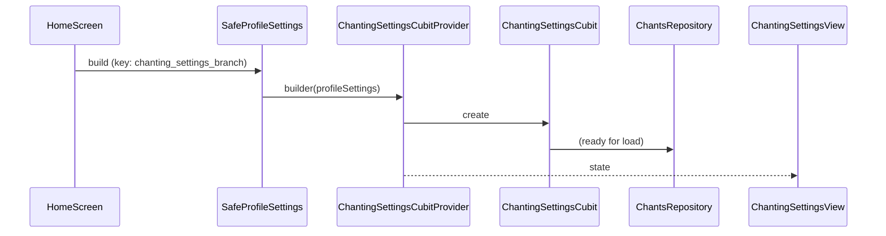
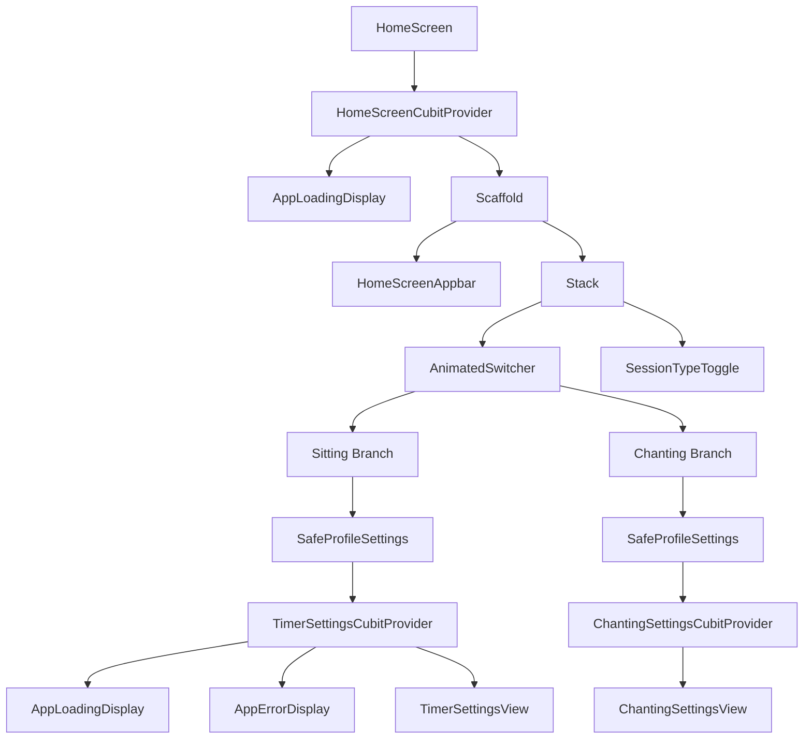

# Home Screen

This document describes the Home Screen feature — the app's main entry point — covering its purpose, layout, state machine, data flow, and the UI components it composes.

## Purpose

The Home Screen is the first screen a user sees after launch. It allows the user to:

- Choose between a **sitting meditation** session and a **chanting** session.
- Configure the settings for the chosen session type.
- Navigate to profile, presence, and timer-settings history from the app-bar.
- Start a session by tapping the start button inside the active settings view.

---

## Entry Point

`HomeScreen` is registered at the root route (`/`) via `HomeRoute` in `lib/widget/app_routes.dart`.

```dart
@TypedGoRoute<HomeRoute>(path: '/', name: 'HOME')
class HomeRoute extends GoRouteData with $HomeRoute {
  final TimerSettings? $extra;
  // ...
  Widget build(...) => HomeScreen(timerSettings: $extra, key: ValueKey($extra));
}
```

The `$extra` parameter carries an optional `TimerSettings` object that can be injected at launch (from `InitResult.timerSettings`) or via deep-link navigation (e.g. from a notification or the timer-settings history screen). A `ValueKey` on the extra ensures the widget rebuilds correctly when settings change.

---

## State Machine

`HomeScreenCubit` manages the screen's lifecycle state. The widget switches on the sealed `HomeScreenState` union:

| State                  | Rendered Widget                          |
|------------------------|------------------------------------------|
| `HomeScreenStateLoading` | `AppLoadingDisplay` (full-screen spinner) |
| `HomeScreenStateLoaded`  | Full `Scaffold` with app-bar and body    |

On cubit creation `HomeScreenCubit.init(timerSettings)` is called immediately:

- **`timerSettings` is non-null** → emits `HomeScreenStateLoaded` with `SessionType.sitting` and the supplied settings — no I/O performed.
- **`timerSettings` is null** → loads the last-persisted `HomeScreenState` from `SharedPreferencesService`. Falls back to `SessionType.sitting` with default settings on error, recording the failure with `CrashlyticsService`.



---

## Layout

Once `HomeScreenStateLoaded` is emitted the screen renders a `Scaffold` with three areas:

```
┌──────────────────────────────────────┐
│  HomeScreenAppbar (transparent,      │
│  extends behind status bar)          │
├──────────────────────────────────────┤
│                                      │
│   buildBody()                        │
│   (TimerSettingsView  ─or─           │
│    ChantingSettingsView)             │
│                                      │
│                   ┌────────────────┐ │
│                   │ SessionType    │ │
│                   │ Toggle (FAB)   │ │
│                   └────────────────┘ │
└──────────────────────────────────────┘
```

- **`extendBodyBehindAppBar: true`** — the body fills the full screen height; the app-bar floats transparently above it.
- The `SessionTypeToggle` is positioned at `bottom: DesignSpec.spacingLg`, `right: DesignSpec.spacingLg` and wrapped in `SafeArea`.
- The body uses `AnimatedSwitcher` (`Durations.medium4`, cubic easing) to cross-fade between the two session branches when the active `SessionType` changes.

---

## Session Type Toggle

`SessionTypeToggle` is a floating action-style button that switches between `SessionType.sitting` and `SessionType.chanting`. Tapping it calls `HomeScreenCubit.setSessionType(...)`, which:

1. Updates the in-memory `HomeScreenStateLoaded` via `copyWith`.
2. Persists the new state to `SharedPreferencesService` as JSON.
3. Emits the updated state, triggering `AnimatedSwitcher` to cross-fade to the new view.

---

## App-Bar (`HomeScreenAppbar`)

The app-bar is context-aware and adjusts its trailing actions based on authentication state and the active `SessionType`:

| Slot     | Widget                        | Condition                                  |
|----------|-------------------------------|--------------------------------------------|
| Leading  | `Today`                       | Always shown (displays today's date)       |
| Trailing | `PresenceButton`              | Signed-in only                             |
| Trailing | `TimerSettingsHistoryButton`  | Signed-in **and** `SessionType.sitting`    |
| Trailing | `ProfileButton`               | Always shown                               |

`SignedIn` is a guard widget that renders its `yes` builder only when an authenticated user is available.

---

## Data Flow

### Sitting Branch



- `SafeProfileSettings` reads `ProfileCubit` and passes `ProfileSettings` down. When the user is not signed in it falls back to `ProfileSettings(id: 'anonymous')`, so the view always has a non-null settings object.
- `TimerSettingsCubitProvider` creates a fresh `TimerSettingsCubit` scoped to this branch. The `ValueKey('timer_settings_branch')` on `SafeProfileSettings` ensures the subtree is preserved across `AnimatedSwitcher` rebuilds.
- Inner state variants:
  - `TimerSettingsDataLoadingState` → `AppLoadingDisplay`
  - `TimerSettingsDataErrorState` → `AppErrorDisplay`
  - `TimerSettingsDataLoadedState` → `TimerSettingsView`

### Chanting Branch



> **Note:** The chanting branch is under active development. The chant list and reorder callback are currently stubs.

---

## Widget Tree



---

## Key Files

| File | Description |
|------|-------------|
| `lib/widget/screen/home_screen.dart` | The `HomeScreen` widget |
| `lib/bloc/home_screen/home_screen_cubit.dart` | `HomeScreenCubit` + `HomeScreenState` |
| `lib/widget/bloc_provider/home_screen_cubit_provider.dart` | DI wrapper that creates and exposes `HomeScreenCubit` |
| `lib/widget/home/home_screen_appbar.dart` | Context-aware app-bar |
| `lib/widget/home/session_type_toggle.dart` | Floating toggle button |
| `lib/widget/bloc_provider/safe_profile_settings.dart` | Profile settings guard with anonymous fallback |
| `lib/widget/bloc_provider/timer_settings_cubit_provider.dart` | Scoped `TimerSettingsCubit` DI wrapper |
| `lib/widget/bloc_provider/chanting_settings_provider.dart` | Scoped `ChantingSettingsCubit` DI wrapper |
| `lib/widget/timer/timer_settings_view.dart` | Sitting session configuration view |
| `lib/widget/chanting/chanting_settings_view.dart` | Chanting session configuration view |
| `lib/widget/app_routes.dart` | `HomeRoute` route definition |
| `test/widget/screen/home_screen_test.dart` | Widget tests for `HomeScreen` |

---

## Behavior Notes

- **Deep-link pre-configuration:** Passing a `TimerSettings` to `HomeScreen` skips all persistence reads and lands the user directly on the sitting configuration with those settings. A `ValueKey` on the constructor parameter ensures Flutter re-creates the widget tree when the settings object changes.
- **Fallback on error:** If `SharedPreferencesService` throws during `init`, the cubit falls back to `SessionType.sitting` with default `TimerSettings` and records the error in Crashlytics. The user is never shown an error state at this level.
- **Scoped cubit lifetime:** Each session branch (`timer_settings_branch` / `chanting_settings_branch`) carries a `ValueKey` so that Flutter preserves — rather than recreates — the cubit subtree when the `AnimatedSwitcher` rebuilds while the same branch is active.
- **Profile settings fallback:** `SafeProfileSettings` always provides a non-null `ProfileSettings` to its children. When the user is anonymous or the profile hasn't loaded yet, `ProfileSettings(id: 'anonymous')` is used so the settings views never block on authentication.

